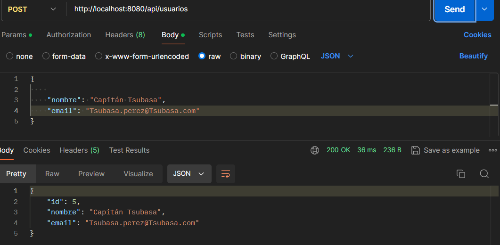
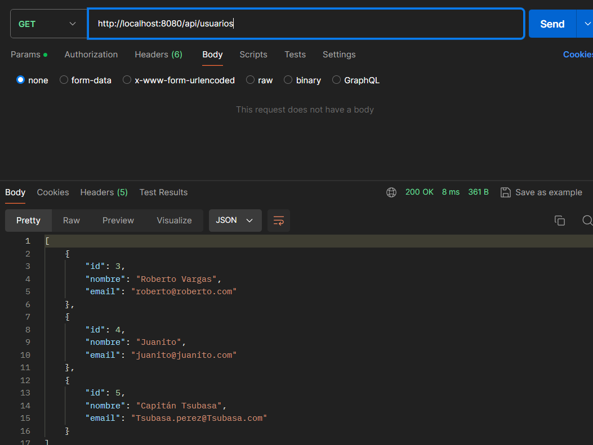

# CRUD-API-SPRING

http://localhost:8080/api/usuarios

Esta es la ruta para hacer las pruebas del CRUD

Deberás de cambiar el tipo de petición: "GET, POST, DELETE, ETC".

De esta manera podrás observar el comportamiento de cada una de ellas.

##Formato para la API##

*{"id":1,"nombre":"Juan Pérez","email":"juan.perez@example.com"}*

* Si estás haciendo una solicitud POST o PUT, haz clic en la pestaña "Body".
* Selecciona "raw" y luego "JSON" en el menú desplegable a la derecha.
* Ingresa el JSON que deseas enviar en el cuerpo de la solicitud. Por ejemplo, para crear un nuevo usuario:

**Lectura**

*Todos:*    http://localhost:8080/api/usuarios

Unicario: http://localhost:8080/api/usuarios/3

**Actualizar**

**Cambiamos el tipo de petición a PUT*

URL: http://localhost:8080/api/usuarios/2

CREATE 

DELETE

READ ALL

**Como podemos observar tenemos todas las fases de un CRUD, realizado con JAVA y PostgreSQL**
